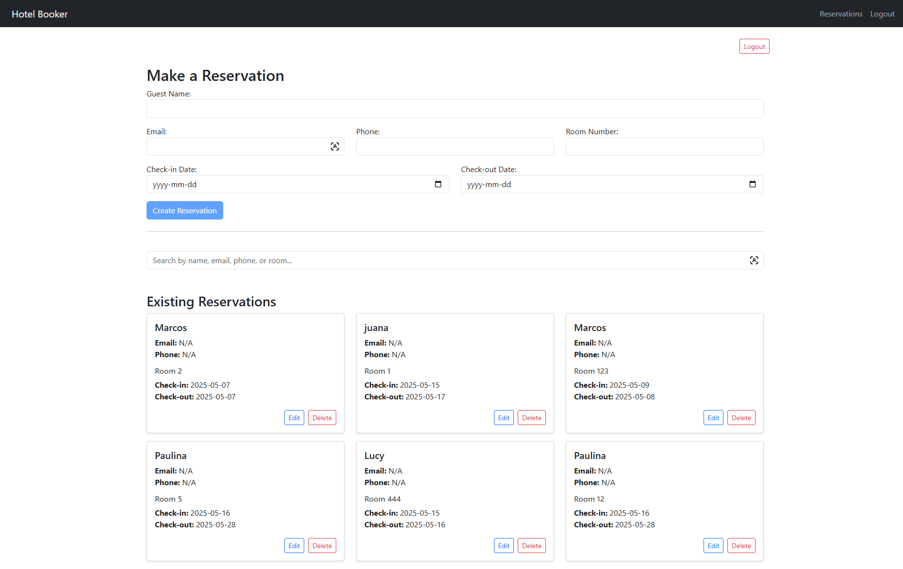
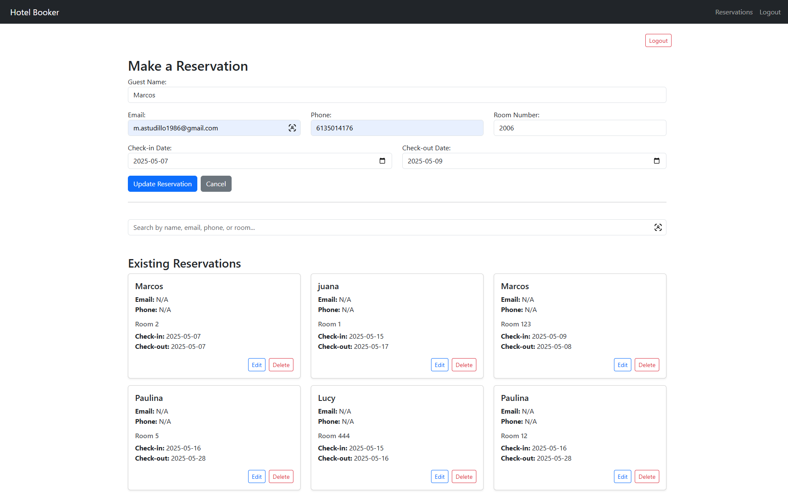
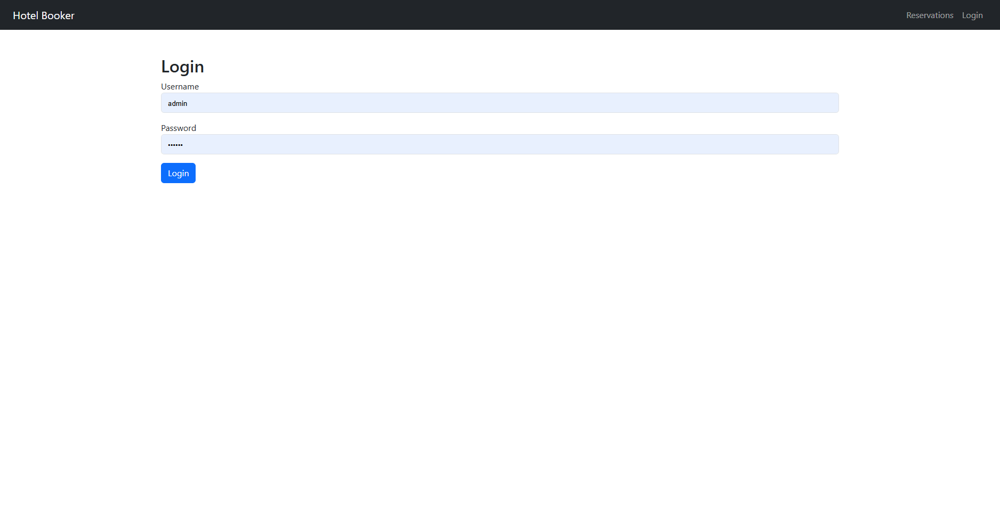

# Hotel Booker – Fullstack App (Django + Angular)


A full-stack hotel reservation management system built with Django (REST API) and Angular.  
This project includes secure login, full CRUD for reservations, responsive UI with Bootstrap, and deployment on Firebase (frontend) and PythonAnywhere (backend).

---

## ✨ Features

- 🔐 JWT-based login authentication
- 📋 Create, view, update, and delete reservations
- 📧 Fields: guest name, email, phone, room number, check-in & check-out
- 🔎 Search reservations by name, room, phone or email
- ⚙️ Protected routes using Angular guards
- 📱 Responsive Bootstrap interface
<!-- - 🌍 Deployed on Firebase & PythonAnywhere -->

---

## 🖼️ Screenshots

### ✅ Home & Reservation List



### ✏️ Editing a Reservation



### 🔐 Login Page



---

## ⚙️ Tech Stack

**Frontend**  
- Angular 17  
- Bootstrap 5  
- Angular Standalone Components  
- Firebase Hosting

**Backend**  
- Django 5  
- Django REST Framework  
- JWT Authentication  
- PythonAnywhere

---

## 🚀 Local Setup

```bash
# Backend
cd hotel-booker
python -m venv env
env\Scripts\activate
pip install -r requirements.txt
python manage.py runserver

# Frontend
cd hotel-booker-frontend
npm install
ng serve
```

📡 Live Demo

🚧 Demo temporarily disabled while updating deployment.
<!--
🔗 Frontend: https://hotel-booker-frontend2.web.app 

🔗 Backend: https://thisisantonio.pythonanywhere.com
-->

## 👨‍💻 About Me

**Marcos Astudillo**  
Full Stack Developer | Python · Django · Angular · Firebase  
📫 Email: [m.astudillo1986@gmail.com](mailto:m.astudillo1986@gmail.com)  
🌐 GitHub: [@ThisIsAntonio](https://github.com/ThisIsAntonio)  
🔗 LinkedIn: [Marcos Antonio Astudillo Carrasco](https://www.linkedin.com/in/marcos-antonio-astudillo-carrasco/)
